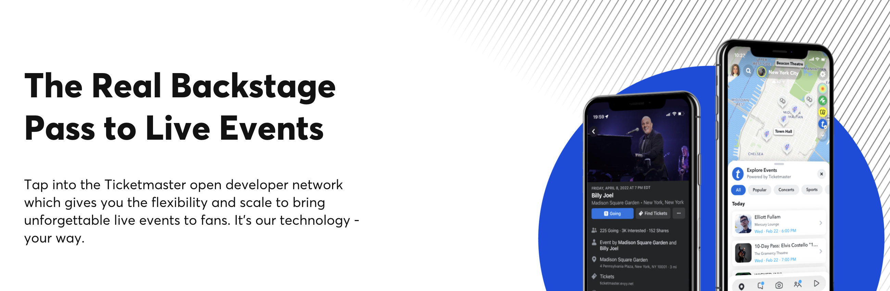

<div align="center">

[](https://developer.ticketmaster.com&#x2F;products-and-docs&#x2F;apis&#x2F;discovery-api&#x2F;v2&#x2F;)

# [Ticketmaster](https://developer.ticketmaster.com&#x2F;products-and-docs&#x2F;apis&#x2F;discovery-api&#x2F;v2&#x2F;)

The Ticketmaster Discovery API allows you to search for events, attractions, or venues.

</div>

## Requirements

Building the API client library requires:

1. Java 1.8+
2. Maven (3.8.3+)/Gradle (7.2+)

If you are adding this library to an Android Application or Library:

3. Android 8.0+ (API Level 26+)

## Installation<a id="installation"></a>
<div align="center">
  <a href="https://konfigthis.com/sdk-sign-up?company=Ticketmaster&%20serviceName=Discovery%20&language=Java">
    
  </a>
</div>

### Maven users

Add this dependency to your project's POM:

```xml
<dependency>
  <groupId>com.konfigthis</groupId>
  <artifactId>ticketmaster-java-sdk</artifactId>
  <version>v2</version>
  <scope>compile</scope>
</dependency>
```

### Gradle users

Add this dependency to your `build.gradle`:

```groovy
// build.gradle
repositories {
  mavenCentral()
}

dependencies {
   implementation "com.konfigthis:ticketmaster-java-sdk:v2"
}
```

### Android users

Make sure your `build.gradle` file as a `minSdk` version of at least 26:
```groovy
// build.gradle
android {
    defaultConfig {
        minSdk 26
    }
}
```

Also make sure your library or application has internet permissions in your `AndroidManifest.xml`:

```xml
<!--AndroidManifest.xml-->
<?xml version="1.0" encoding="utf-8"?>
<manifest xmlns:android="http://schemas.android.com/apk/res/android"
    xmlns:tools="http://schemas.android.com/tools">
    <uses-permission android:name="android.permission.INTERNET"/>
</manifest>
```

### Others

At first generate the JAR by executing:

```shell
mvn clean package
```

Then manually install the following JARs:

* `target/ticketmaster-java-sdk-v2.jar`
* `target/lib/*.jar`

## Getting Started

Please follow the [installation](#installation) instruction and execute the following Java code:

```java
import com.konfigthis.client.ApiClient;
import com.konfigthis.client.ApiException;
import com.konfigthis.client.ApiResponse;
import com.konfigthis.client.Ticketmaster;
import com.konfigthis.client.Configuration;
import com.konfigthis.client.auth.*;
import com.konfigthis.client.model.*;
import com.konfigthis.client.api.V2Api;
import java.util.List;
import java.util.Map;
import java.util.UUID;

public class Example {
  public static void main(String[] args) {
    Configuration configuration = new Configuration();
    configuration.host = "http://www.ticketmaster.com/discovery/v2";
    
    configuration.apiKey  = "YOUR API KEY";
    Ticketmaster client = new Ticketmaster(configuration);
    String sort = "relevance,desc"; // Sorting order of the search result. Allowable values : 'name,asc', 'name,desc', 'date,asc', 'date,desc', 'relevance,asc', 'relevance,desc', 'distance,asc', 'name,date,asc', 'name,date,desc', 'date,name,asc', 'date,name,desc','onsaleStartDate,asc', 'id,asc'
    String startDateTime = ""; // Filter events with a start date after this date
    String endDateTime = ""; // Filter events with a start date before this date
    String onsaleStartDateTime = ""; // Filter events with onsale start date after this date
    String onsaleOnStartDate = ""; // Filter events with onsale start date on this date
    String onsaleOnAfterStartDate = ""; // Filter events with onsale range within this date
    String onsaleEndDateTime = ""; // Filter events with onsale end date before this date
    String city = ""; // Filter events by city
    String countryCode = ""; // Filter events by country code
    String stateCode = ""; // Filter events by state code
    String postalCode = ""; // Filter events by postal code / zipcode
    String venueId = ""; // Filter events by venue id
    String attractionId = ""; // Filter events by attraction id
    String segmentId = ""; // Filter events by segment id
    String segmentName = ""; // Filter events by segment name
    List<Object> classificationName = Arrays.asList(null); // Filter events by classification name: name of any segment, genre, sub-genre, type, sub-type
    List<Object> classificationId = Arrays.asList(null); // Filter events by classification id: id of any segment, genre, sub-genre, type, sub-type
    String marketId = ""; // Filter events by market id
    String promoterId = ""; // Filter events by promoter id
    String dmaId = ""; // Filter events by dma id
    String includeTBA = "true"; // True, to include events with date to be announce (TBA)
    String includeTBD = "true"; // True, to include event with a date to be defined (TBD)
    String clientVisibility = ""; // Filter events by clientName
    String latlong = ""; // Filter events by latitude and longitude, this filter is deprecated and maybe removed in a future release, please use geoPoint instead
    String radius = "50"; // Radius of the area in which we want to search for events.
    String unit = "miles"; // Unit of the radius
    String geoPoint = ""; // filter events by geoHash
    String keyword = ""; // Keyword to search on
    String id = ""; // Filter entities by its id
    String source = "ticketmaster"; // Filter entities by its source name
    String includeTest = "true"; // True if you want to have entities flag as test in the response. Only, if you only wanted test entities
    String page = "0"; // Page number
    String size = "20"; // Page size of the response
    String locale = "en"; // The locale in ISO code format. Multiple comma-separated values can be provided. When omitting the country part of the code (e.g. only 'en' or 'fr') then the first matching locale is used. When using a '*' it matches all locales. '*' can only be used at the end (e.g. 'en-us,en,*') 
    String includeLicensedContent = "true"; // Yes if you want to display licensed content
    String includeSpellcheck = "true"; // yes, to include spell check suggestions in the response.
    try {
      List<Event> result = client
              .v2
              .eventSearch()
              .sort(sort)
              .startDateTime(startDateTime)
              .endDateTime(endDateTime)
              .onsaleStartDateTime(onsaleStartDateTime)
              .onsaleOnStartDate(onsaleOnStartDate)
              .onsaleOnAfterStartDate(onsaleOnAfterStartDate)
              .onsaleEndDateTime(onsaleEndDateTime)
              .city(city)
              .countryCode(countryCode)
              .stateCode(stateCode)
              .postalCode(postalCode)
              .venueId(venueId)
              .attractionId(attractionId)
              .segmentId(segmentId)
              .segmentName(segmentName)
              .classificationName(classificationName)
              .classificationId(classificationId)
              .marketId(marketId)
              .promoterId(promoterId)
              .dmaId(dmaId)
              .includeTBA(includeTBA)
              .includeTBD(includeTBD)
              .clientVisibility(clientVisibility)
              .latlong(latlong)
              .radius(radius)
              .unit(unit)
              .geoPoint(geoPoint)
              .keyword(keyword)
              .id(id)
              .source(source)
              .includeTest(includeTest)
              .page(page)
              .size(size)
              .locale(locale)
              .includeLicensedContent(includeLicensedContent)
              .includeSpellcheck(includeSpellcheck)
              .execute();
      System.out.println(result);
    } catch (ApiException e) {
      System.err.println("Exception when calling V2Api#eventSearch");
      System.err.println("Status code: " + e.getStatusCode());
      System.err.println("Reason: " + e.getResponseBody());
      System.err.println("Response headers: " + e.getResponseHeaders());
      e.printStackTrace();
    }

    // Use .executeWithHttpInfo() to retrieve HTTP Status Code, Headers and Request
    try {
      ApiResponse<List<Event>> response = client
              .v2
              .eventSearch()
              .sort(sort)
              .startDateTime(startDateTime)
              .endDateTime(endDateTime)
              .onsaleStartDateTime(onsaleStartDateTime)
              .onsaleOnStartDate(onsaleOnStartDate)
              .onsaleOnAfterStartDate(onsaleOnAfterStartDate)
              .onsaleEndDateTime(onsaleEndDateTime)
              .city(city)
              .countryCode(countryCode)
              .stateCode(stateCode)
              .postalCode(postalCode)
              .venueId(venueId)
              .attractionId(attractionId)
              .segmentId(segmentId)
              .segmentName(segmentName)
              .classificationName(classificationName)
              .classificationId(classificationId)
              .marketId(marketId)
              .promoterId(promoterId)
              .dmaId(dmaId)
              .includeTBA(includeTBA)
              .includeTBD(includeTBD)
              .clientVisibility(clientVisibility)
              .latlong(latlong)
              .radius(radius)
              .unit(unit)
              .geoPoint(geoPoint)
              .keyword(keyword)
              .id(id)
              .source(source)
              .includeTest(includeTest)
              .page(page)
              .size(size)
              .locale(locale)
              .includeLicensedContent(includeLicensedContent)
              .includeSpellcheck(includeSpellcheck)
              .executeWithHttpInfo();
      System.out.println(response.getResponseBody());
      System.out.println(response.getResponseHeaders());
      System.out.println(response.getStatusCode());
      System.out.println(response.getRoundTripTime());
      System.out.println(response.getRequest());
    } catch (ApiException e) {
      System.err.println("Exception when calling V2Api#eventSearch");
      System.err.println("Status code: " + e.getStatusCode());
      System.err.println("Reason: " + e.getResponseBody());
      System.err.println("Response headers: " + e.getResponseHeaders());
      e.printStackTrace();
    }
  }
}

```

## Documentation for API Endpoints

All URIs are relative to *http://www.ticketmaster.com/discovery/v2*

Class | Method | HTTP request | Description
------------ | ------------- | ------------- | -------------
*V2Api* | [**eventSearch**](docs/V2Api.md#eventSearch) | **GET** /discovery/v2/events | Event Search
*V2Api* | [**findSuggest**](docs/V2Api.md#findSuggest) | **GET** /discovery/v2/suggest | Find Suggest
*V2Api* | [**findVenues**](docs/V2Api.md#findVenues) | **GET** /discovery/v2/venues | Venue Search
*V2Api* | [**getAttractionDetails**](docs/V2Api.md#getAttractionDetails) | **GET** /discovery/v2/attractions/{id} | Get Attraction Details
*V2Api* | [**getClassificationDetails**](docs/V2Api.md#getClassificationDetails) | **GET** /discovery/v2/classifications/{id} | Get Classification Details
*V2Api* | [**getEventDetails**](docs/V2Api.md#getEventDetails) | **GET** /discovery/v2/events/{id} | Get Event Details
*V2Api* | [**getEventImages**](docs/V2Api.md#getEventImages) | **GET** /discovery/v2/events/{id}/images | Get Event Images
*V2Api* | [**getGenreDetails**](docs/V2Api.md#getGenreDetails) | **GET** /discovery/v2/classifications/genres/{id} | Get Genre Details
*V2Api* | [**getSegmentDetails**](docs/V2Api.md#getSegmentDetails) | **GET** /discovery/v2/classifications/segments/{id} | Get Segment Details
*V2Api* | [**getSubgenreDetails**](docs/V2Api.md#getSubgenreDetails) | **GET** /discovery/v2/classifications/subgenres/{id} | Get Sub-Genre Details
*V2Api* | [**getVenueDetails**](docs/V2Api.md#getVenueDetails) | **GET** /discovery/v2/venues/{id} | Get Venue Details
*V2Api* | [**searchAttractions**](docs/V2Api.md#searchAttractions) | **GET** /discovery/v2/attractions | Attraction Search
*V2Api* | [**searchClassifications**](docs/V2Api.md#searchClassifications) | **GET** /discovery/v2/classifications | Classification Search


## Documentation for Models

 - [AccessDates](docs/AccessDates.md)
 - [Accessibility](docs/Accessibility.md)
 - [Address](docs/Address.md)
 - [Area](docs/Area.md)
 - [Attraction](docs/Attraction.md)
 - [Attribution](docs/Attribution.md)
 - [Attributions](docs/Attributions.md)
 - [Chronology](docs/Chronology.md)
 - [City](docs/City.md)
 - [Classification](docs/Classification.md)
 - [Country](docs/Country.md)
 - [DateTimeField](docs/DateTimeField.md)
 - [DateTimeFieldType](docs/DateTimeFieldType.md)
 - [DateTimeZone](docs/DateTimeZone.md)
 - [DisplaySettingExtension](docs/DisplaySettingExtension.md)
 - [Dma](docs/Dma.md)
 - [DurationField](docs/DurationField.md)
 - [DurationFieldType](docs/DurationFieldType.md)
 - [EndDates](docs/EndDates.md)
 - [EntityChanges](docs/EntityChanges.md)
 - [Event](docs/Event.md)
 - [EventDates](docs/EventDates.md)
 - [EventImages](docs/EventImages.md)
 - [EventSalesDates](docs/EventSalesDates.md)
 - [EventStatus](docs/EventStatus.md)
 - [ExternalLink](docs/ExternalLink.md)
 - [Genre](docs/Genre.md)
 - [GeocodeExtension](docs/GeocodeExtension.md)
 - [GeolocationVenueExtensions](docs/GeolocationVenueExtensions.md)
 - [Geometry](docs/Geometry.md)
 - [Image](docs/Image.md)
 - [Level](docs/Level.md)
 - [LocalTime](docs/LocalTime.md)
 - [Locale](docs/Locale.md)
 - [Location](docs/Location.md)
 - [Market](docs/Market.md)
 - [Outlet](docs/Outlet.md)
 - [Parking](docs/Parking.md)
 - [Place](docs/Place.md)
 - [Presale](docs/Presale.md)
 - [PriceRange](docs/PriceRange.md)
 - [Product](docs/Product.md)
 - [Promoter](docs/Promoter.md)
 - [PublicSaleDates](docs/PublicSaleDates.md)
 - [Relationship](docs/Relationship.md)
 - [SeatMap](docs/SeatMap.md)
 - [Segment](docs/Segment.md)
 - [Social](docs/Social.md)
 - [StartDates](docs/StartDates.md)
 - [State](docs/State.md)
 - [TicketmasterEventExtensions](docs/TicketmasterEventExtensions.md)
 - [Twitter](docs/Twitter.md)
 - [Venue](docs/Venue.md)
 - [VenueBoxOfficeInfo](docs/VenueBoxOfficeInfo.md)
 - [VenueExtensions](docs/VenueExtensions.md)
 - [VenueGeneralInfo](docs/VenueGeneralInfo.md)


## Author
This Java package is automatically generated by [Konfig](https://konfigthis.com)
